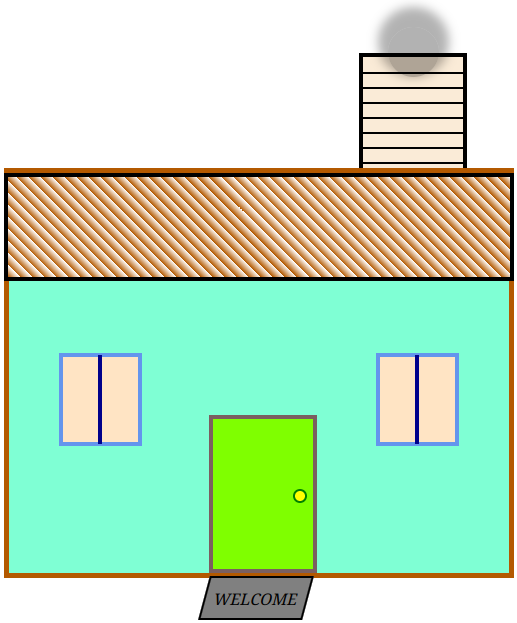

# 🏠 CSS Positioning House Painting

This project demonstrates the use of **HTML and CSS positioning** to visually construct and style an abstract house. It showcases a range of CSS techniques such as absolute and relative positioning, gradients, shadows, and layering. The layout is intended to resemble a painted house using only semantic HTML and custom CSS.

---

## 📁 File Structure

```bash
css-positioning-house-painting/
├── images/
│   └── preview.png         # Screenshot or preview of the house
├── index.html              # Main HTML structure
├── styles.css              # Styling and layout logic
├── .gitignore              # Git configuration
├── LICENSE                 # License for project use
└── README.md               # Project documentation
```

## 🎯 Project Goals
1. Practice and demonstrate advanced CSS positioning (absolute, relative)

2. Create an abstract house layout using pure HTML and CSS

3. Showcase design techniques including:

    - `box-shadow`
    - `border-radius`
    - `repeating-linear-gradient()`
    - `transform`
    - `z-index` and more

4. Provide a creative visual representation without images or frameworks

## 🌈 Features & Techniques Used
- ✅ **`position`**: relative for overall house context

- ✅ **`position`**: absolute for accurate placement of all elements

- ✅ **CSS gradients** for roof shading

- ✅ **Flexbox** used to center welcome mat text

- ✅ Use of **`z-index`** to manage element stacking (e.g. chimney behind house)

- ✅ Rounded and colored elements to simulate windows, door, smoke, etc.

- ✅ **`Skew`** and **`transform`** effects for realism

## 🏗️ Elements Breakdown
- **House Base**: Aquamarine block centered on the page

- **Roof**: Styled with a repeating-linear-gradient for tile effect

- **Chimney**: Includes decorative horizontal lines and rising smoke

- **Windows**: Symmetrical placement with a vertical divider

- **Door**: Includes a circular door handle and styling

- **Welcome Mat**: Positioned below the door with skew effect

## Preview


## 🚀 How to Use
1. Clone the repository:
    ```
    git clone https://github.com/karianjahi/css-positioning-house-painting.git
    ```
2. Open the project folder and run in your browser:
    ```
    cd css-positioning-house-painting
    open index.html
    ```
3. Or just drag **index.html** into any modern browser.


## 📚 What You’ll Learn
- Deep understanding of CSS positioning context

- Combining multiple styling techniques in a single layout

- Managing layout complexity without frameworks

- Hands-on practice in building UI structures from scratch

## 📝 License
This project is licensed under the MIT License. See LICENSE for details.

## 🙌 Acknowledgements
Created as a fun and educational demonstration of how powerful plain HTML and CSS can be — no JavaScript or libraries needed!

## 📫 Contact
If you have suggestions, ideas, or want to collaborate:

- 📧 Email: nkarianjahi@gmail.com

- 🌐 GitHub: @karianjahi

- [Linkedin](www.linkedin.com/in/josephkarianjahinjeri)
